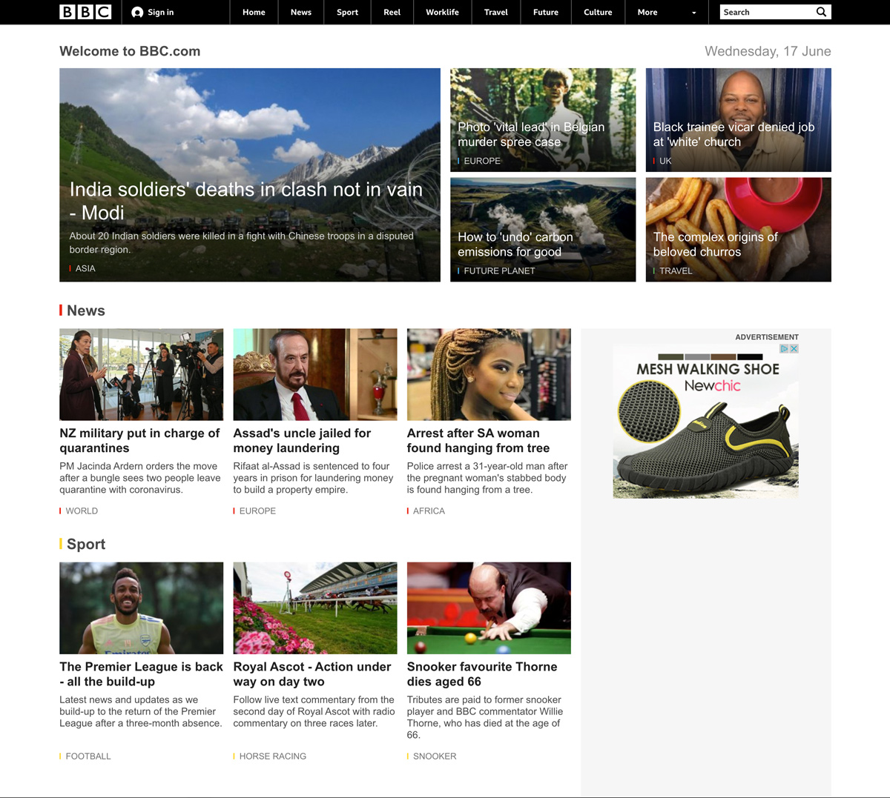

# BBC Hompage

To get familiar with BEM and Sass... some basic object orientated css and html has been supplied for you to refactor.

## Run on local dev

Use VSCODE liver server to run a local server.

## 1. BEM

- Search for opportunities to use BEM and convert sections of the site to logical components in BEM style.
- Take ownership of the code, there are some bad class names, bad practices and html find them and fix them.

## 2. Sass

- Convert the project to Sass project
- Break up the single CSS file ito Sass partials
- use the [Live Sass Compiler](https://marketplace.visualstudio.com/items?itemName=ritwickdey.live-sass) for VSCODE.

API used: [newsapi.org](https://newsapi.org)

### Screenshot

